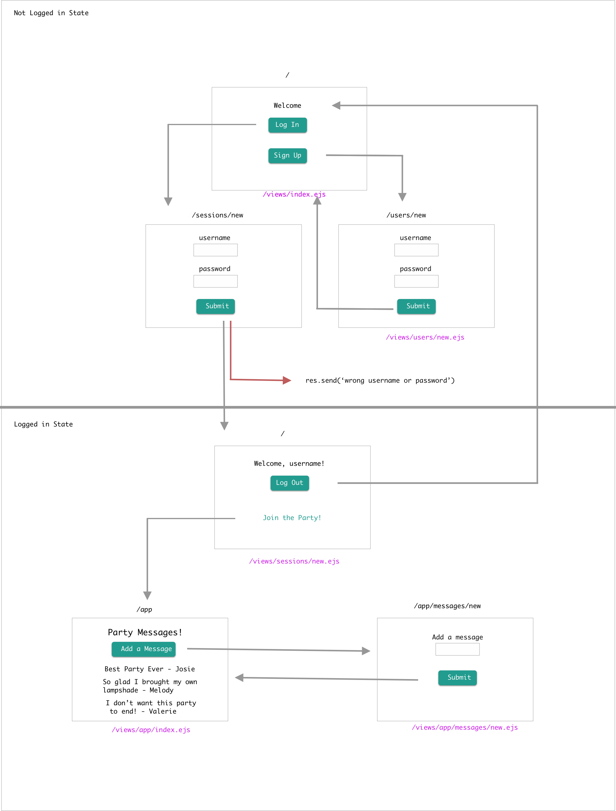

## Continue

Looking at our diagram our buttons should go to
- `/sessions/new` and render `/views/sessions/new.ejs`
- `/users/new` and render `/views/users/new.ejs`

Let's set up our users controller first. Once set up we should be able to render our new user form


  

<br><br>

**controllers/users.js**

```js
const express = require('express')
const user = express.Router()
const User = require('../models/users.js')

user.get('/new', (req, res) => {
  res.render('users/new.ejs')
})

module.exports = user
```

**server.js**

```js
const userController = require('./controllers/users.js')
app.use('/users', userController)
```

Finally, we need to update the URL in our `index.ejs`

```html
<h1>Welcome</h1>
  <a class="waves-effect waves-light btn" href="/users/new">Sign Up</a></h2>
```

Now we should be able to see our Create User form

Let's repeat for our sessions form

**controllers/sessions.js**
```js
const express = require('express')
const sessions = express.Router()

sessions.get('/new', (req, res) => {
  res.render('sessions/new.ejs')
})

module.exports = sessions
```

**server.js**

```js
const sessionsController = require('./controllers/sessions.js')
app.use('/sessions', sessionsController)
```

Finally, we need to update the URL in our `index.ejs`

```js
<h3>or</h3>
<a class="waves-effect waves-light btn" href="/sessions/new">Log In</a>
```

### Let's Create Users

We are going to have to make a POST request to /users.

**views/users/new.ejs**
```html
<form class="col s12" action="/users" method="POST">
```

When we make this POST request, we'll have to `create` a new user in our database.

Before we can do that, we have to make a model for our users

**models/users.js**
```js
const mongoose = require('mongoose')
const Schema = mongoose.Schema

const userSchema = Schema({
  username: String,
  password: String
})

const User = mongoose.model('User', userSchema)

module.exports = User
```

**controllers/users.js**
We'll have to
- require our model
- then create our post route
- upon successful create let's redirect back to our welcome page

```js

const express = require('express')
const users = express.Router()
const User = require('../models/users.js')

users.get('/new', (req, res) => {
  res.render('users/new.ejs')
})

users.post('/', (req, res) => {
  User.create(req.body, (err, createdUser) => {
    if (err) {
      console.log(err)
    }
    console.log(createdUser);
    res.redirect('/')
  })
})

module.exports = users
```

### Use express-session as middleware

Now we want to create sessions so the user can log in and later, once the user is logged in they'll have access to new parts of the site.

```
npm install express-session
```

Require it in `server.js`

**server.js**

```js
const session = require('express-session')
```

Store Secret in `.env `

```yml
PORT=3000
MONGODB_URI=mongodb://localhost:27017/auth_lesson
SECRET=feedmeseymour
```

Remember `app.use()` is middleware. It belongs in the middle - after your dependencies and configurations but BEFORE your routes. If you place it after your routes those routes won't have the functionality of the middleware

```js
app.use(session({
  secret: process.env.SECRET,
  resave: false,
  saveUninitialized: false
}))
```


BUILD USER MODEL

**models/users.js**

```js
const mongoose = require('mongoose')
const Schema = mongoose.Schema

const userSchema = Schema({
  username: String,
  password: String
})

const User = mongoose.model('User', userSchema)

module.exports = User
```

BUILD SESSIONS CONTROLLER

**controllers/sessions.js**

```js
const express = require('express');
const sessions = express.Router();
const User = require('../models/users.js');

sessions.get('/new', (req, res)=>{
    res.render('sessions/new.ejs');
})

module.exports = router;
```

**server.js**

```js
const sessionsController = require('./controllers/sessions.js');
app.use('/sessions', sessionsController);
```

Our post request is going to set up a session for our user. We'll add the user data to our sessions object and we'll be able to have access to it throughout our app.

**controllers/sessions.js**

```js
sessions.post('/', (req, res)=>{
    User.findOne({ username: req.body.username }, (err, foundUser) => {
        if(req.body.password == foundUser.password){
          req.session.currentUser = foundUser
            res.redirect('/')
        } else {
          res.send('<a href="/">wrong password</a>')
        }
    });
});

```

**views/sessions/new.ejs**

```html
  <form class="col s12" action="/sessions" method="POST">
```

We can write a bit of code to see our session data in our welcome page

**server.js**

```js
res.render('index.ejs', {
    currentUser: req.session.currentUser
});
```
**views/index.ejs**

```html
<h1>
  <% if(currentUser) { %>
    Welcome <%=currentUser.username%>!
    <a class="waves-effect waves-light btn" href="/sessions/">Log Out</a>
  </h1>
  <% } else { %>
    <h2>Please </h2>
    <a class="waves-effect waves-light btn" href="/users/new">Sign Up</a></h2>
    <h3>or</h3>
    <a class="waves-effect waves-light btn" href="/sessions/new">Log In</a>
  <% } %>
</div>
```
Success!


Let's get that log out button working!

An anchor tag can't make a delete request. We must make a form. But we can disguise our form as a button!

**views/index.hmtl**
```html
  <form action="/sessions?_method=DELETE" method="POST">
    <input type="submit" value="Logout" class="waves-effect waves-light btn"/>
</form>
```

**controllers/sessions.js**

```js
sessions.delete('/', (req, res)=>{
    req.session.destroy(() => {
        res.redirect('/')
    })
})
```
### Special Page for Logged in Users

We did a ton of work to get our sessions working. Right now all we see is our name if we are logged in on the home page. But we'd likely want to see special parts of a site. In this case it's going to be messages from guests at a secret party

**views/app/index.ejs**

```html
<!DOCTYPE html>
<html lang="en" dir="ltr">
  <head>
    <% include ./partials/head.ejs %>
  </head>
  <body>
    <h1>Welcome to the Party</h1>
  </body>
</html>
```

**views/index.ejs**

```html
<h1>
  <% if(currentUser) { %>
    Welcome <%=currentUser.username %>!
</h1>
<h2>
  <a class="waves-effect waves-light btn" href="/app">Join the Party</a>
</h2>
```
**server.js**

```js
app.get('/app', (req, res)=>{
  res.render('app/index.ejs')
})
```

We can control who sees the link. But people can still crash our party if they know the URL. We'll need to add some logic to be sure only our logged in users can join the party. To help our site visitors out - we want them to log in to go to the party, if they are not logged in we'll direct them to the log in page (hint hint!)

```js
app.get('/app', (req, res)=>{
    if(req.session.currentUser){
        res.render('app/index.ejs')
    } else {
        res.redirect('/sessions/new');
    }
})
```

This party needs more salt! Let's get those passwords more secure by hashing them with bcrypt
